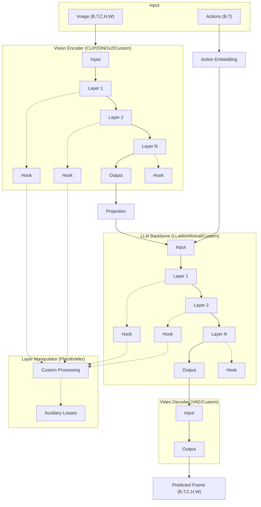
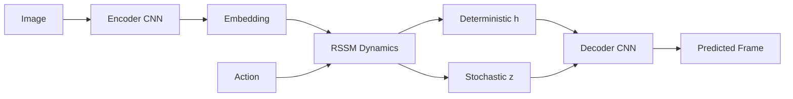

# World Model Base

Latent 기반 월드 모델 학습/추론 프레임워크. DreamerV3 스타일의 RSSM (Recurrent State-Space Model) 아키텍처 기반.

## Features

- **Modular Architecture**: Encoder, Dynamics, Decoder 모듈 교체 가능
- **Pretrained Finetuning**: Local 체크포인트 또는 HuggingFace Hub에서 로드
- **Game-like Inference**: Action → Frame 렌더링 파이프라인
- **ato Config**: 유연한 configuration 시스템

## Installation

```bash
conda env create -f environment.yaml
conda activate world
```

## Quick Start

### Training

```bash
# Default training
python train.py data.path=path/to/data

# Debug mode (small model)
python train.py debug data.path=path/to/data

# High resolution
python train.py high_res data.path=path/to/data
```

### Finetuning

```bash
# From local checkpoint
python finetune.py finetune finetune.pretrained_path=checkpoints/epoch_100.pt data.path=path/to/data

# From HuggingFace Hub
python finetune.py finetune finetune_from_hub finetune.hub_repo=username/world-model data.path=path/to/data

# Freeze encoder only
python finetune.py finetune finetune.pretrained_path=model.pt finetune.freeze_modules="['encoder']"
```

### Inference

```bash
# Interactive rollout from checkpoint
python inference.py checkpoints/final.pt --output rollout.gif --steps 100

# From HuggingFace Hub
python inference.py username/world-model --hub --output rollout.gif
```

### Interactive Demo

```bash
python demo.py demo_mode demo.model_path=checkpoints/final.pt
```

## Architecture

### FlexibleWorldModel (Pretrained 플러그인)



### WorldModel (RSSM - 기본)



### Directory Structure

```
wm_base/
├── environment.yaml          # conda 'world' 환경
├── config.py                 # ato scope configuration
├── train.py                  # 학습 엔트리포인트
├── finetune.py               # pretrained finetuning
├── inference.py              # 추론 파이프라인
├── demo.py                   # 인터랙티브 데모
├── dataset.py                # 데이터 로딩
├── models/
│   ├── encoder.py            # CNN 인코더
│   ├── decoder.py            # Transposed CNN 디코더
│   ├── dynamics.py           # RSSM dynamics
│   ├── world_model.py        # WorldModel (RSSM)
│   ├── backbone.py           # Pretrained wrapper classes
│   │   ├── VisionEncoderWrapper
│   │   ├── LLMBackboneWrapper
│   │   ├── VideoDecoderWrapper
│   │   ├── LayerOutputCollector
│   │   └── LayerManipulator
│   └── flexible_world_model.py  # FlexibleWorldModel
└── utils/
    ├── checkpoint.py         # 체크포인트 유틸
    ├── visualization.py      # 시각화 (gif/mp4)
    └── hub.py                # HuggingFace Hub 통합
```

## Module Replacement

```python
from models import WorldModel

model = WorldModel(...)

# Get/set modules
encoder = model.get_module('encoder')
model.set_module('encoder', CustomEncoder(...))

# Freeze/unfreeze
model.freeze_module('encoder')
model.unfreeze_module('decoder')
```

## HuggingFace Hub

```python
from utils.hub import push_to_hub, create_from_pretrained

# Upload
push_to_hub(model, 'username/my-world-model')

# Download
model = create_from_pretrained('username/my-world-model')
```

## Data Format

HDF5 file with:
- `frames`: (N, T, C, H, W) or (N, T, H, W, C) float [0-255]
- `actions`: (N, T) int

Or directory of .npz files with `frames` and `actions` keys.

## Configuration

See `config.py` for all options. Available views:
- `default`: Standard settings
- `debug`: Small model for testing
- `finetune`: Lower LR, freeze encoder
- `high_res`: 128x128 images
- `atari`: Atari game preset

## License

MIT
